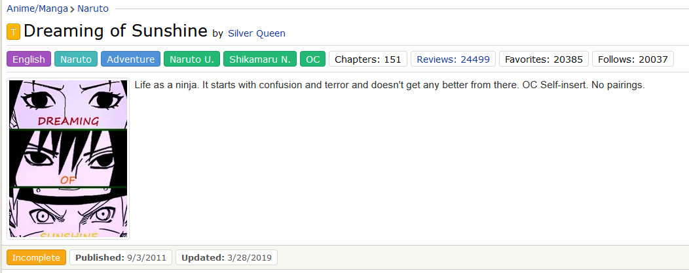
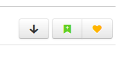
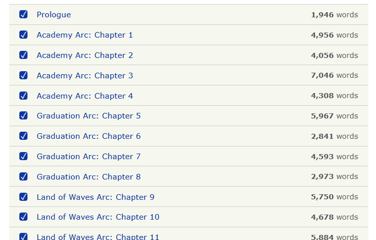
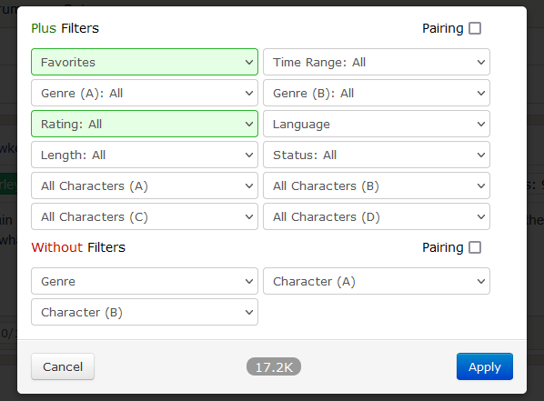

# FanFiction Enhancements

This userscript overhauls FanFiction.net for a better reading experience. It features a better story profile view with easier to read tags, sensible default formatting of text, a chapter view for stories with tracking of already-read chapters and easier interaction with site features.

## Features

### Easy to read story information

* Rating of story, title and author are easily visible
* Story tags can easily be differentiated and are color-coded by type
* Bigger version of cover images by default, no jumping around on hover
* Footer with status, important dates and the word count

### Quick actions

* Quick links to follow and favorite the story
* Download the story as an epub file for e-reader/offline reading (ask the author before redistributing it!)

### Better chapter overview

* Better overview of the chapters in the story
* Read chapters are marked automatically
* Word-count per chapter
* Caveat: The word counts and chapter read status are not transferred between browsers

### Persistent filters

* Persistent filters for most lists
* Remembers if you wanted to see every rating or sort by favorites
* Caveat: The filters are not transferred between browsers

## Installation

To execute this userscript, a userscript runner like [Tampermonkey](https://www.tampermonkey.net/) is needed.

When you have installed the addon, use [this link](https://amur-tiger.github.io/fanfiction-enhancements/latest/fanfiction-enhancements.user.js) to open the userscript. The addon should recognize the script as a userscript and offer to install it for you. If a normal download window appears, then the userscript runner might not be installed correctly.

## Changelog

See [CHANGELOG.md](CHANGELOG.md) for recent changes.
